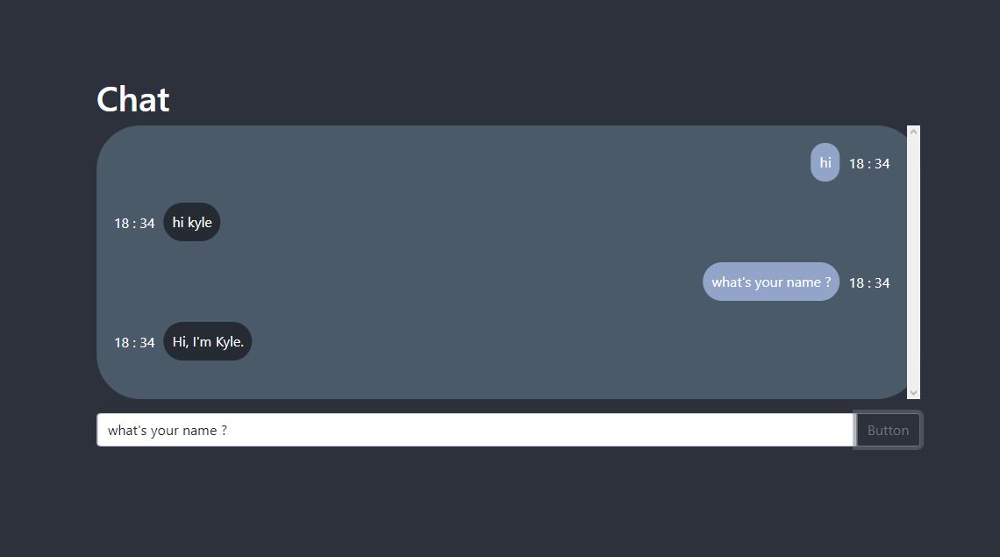

# ChatBot

Chat Bot website written with VueJS, BootStrap and Firebase (done).

The Conv AI is used from HuggingFace and is built into API by Flask for js to call.

The conversation will be stored in Firebase each chat. After the user click the button, VueJS will send a HTTP request (POST) to Flask API. The API will fetch the chat's history , concatnate all the conversation and perform the HuggingFace's model to return the bot's reply to VueJS meanwhile updating the Firebase's storage.

# Visualization

# Installation

### Run the API

#### Install all requirements

`pip install -r ./public/chatbot/requirements.txt

#### Run the API

`python ./public/chatbot/app.py